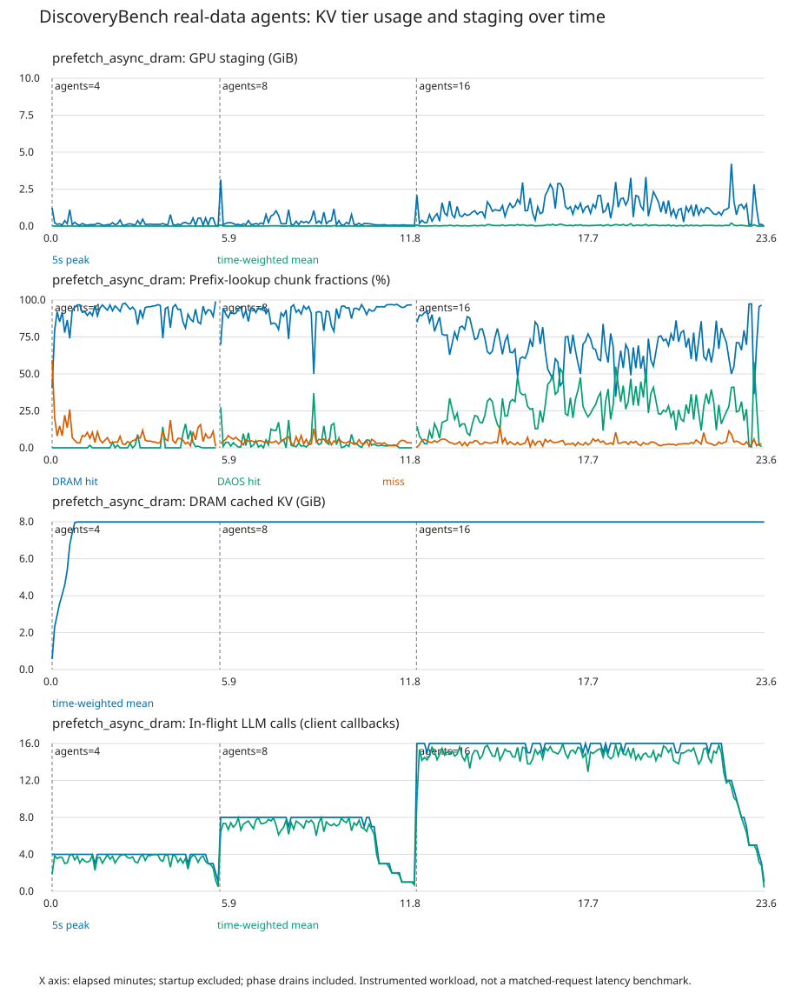

# 비동기 DRAM 보관·읽기 승격: 장시간 벤치마크

## 실험 조건

- Qwen3-14B BF16, H100 NVL 한 개, vLLM 한 프로세스, DAOS object 경로.
- DiscoveryBench real 메타데이터 32개 각각의 첫 질문을 순환해서 실제 Python 실행을 포함한 ReAct 작업 수행. 전체 데이터셋 실행·정답 채점은 아님.
- DRAM 8GiB, GPU staging 10GiB, 청크 128토큰, I/O·메타데이터 worker 각 16개.
- 동시 에이전트 4개 5분 → 8개 5분 → 16개 10분. 단계별 마무리 시간 포함, 모델 로딩 제외.
- 새 DAOS namespace 및 새 프로세스에서 논리적 cold 시작. 서버 물리 캐시는 비우지 않음.
- GPU-direct 쓰기 ON, 쓰기 후 비동기 DRAM 보관 ON, DAOS 읽기 후 비동기 DRAM 승격 ON, CPU lookup LRU 갱신 ON.
- DAOS→GPU staging 프리페치 ON. DRAM→GPU staging 프리페치 OFF. vLLM 자체 prefix cache OFF.
- DRAM 복사 대기 예산 1GiB, 복사 시작 전 대기 제한 100ms. 이 한도를 넘으면 DRAM 보관만 생략.

## 시간 그래프



[벡터 그래프](timeline.svg) · [5초 구간 원자료 CSV](prefetch_async_dram/timeline.csv)

GPU staging은 예약 용량이 아니라 활성 할당량이다. DAOS 읽기, 새 KV 쓰기, 비동기 DRAM 복사 때문에 유지하는 원본 버퍼를 모두 포함한다. 이들 용도의 점유를 개별 분리한 그래프는 아니다.

위에서부터 staging 최대·시간 가중 평균, DRAM/DAOS/miss 비율, DRAM 캐시 점유, 진행 중 모델 호출 수다. 세로 점선은 단계 시작이다. 각 단계에는 마지막 요청들의 마무리 시간이 포함된다.

Hit 비율 분모는 비동기 prefix lookup 대상 청크 수다. DRAM에 먼저 hit한 청크는 DAOS에 중복 계상하지 않는다. 전체 입력 토큰 비율이나 DAOS 조회 자체의 성공률과는 다르다. 조회 없는 시간 구간은 공백이다.

## 전체 결과

| 항목 | 결과 |
|---|---:|
| 관측 시간 | 23.60분 |
| 작업 / 모델 호출 / Python 실행 | 287 / 2477 / 2214 |
| 작업 상태 | {'complete': 246, 'incomplete': 36, 'failed': 5} |
| 조회 청크 | 136,065 |
| DRAM / DAOS / miss | 77.37% / 18.39% / 4.24% |
| staging 최대 / 평균 | 4.219 / 0.025GiB |
| staging이 비어 있던 시간 비율 | 91.01% |
| DRAM 캐시 최대 / 평균 | 7.988 / 7.867GiB |
| GPU staging 할당 실패 | 0 |

## 단계별 hit와 staging

| 동시 에이전트 | 모델 호출 | DRAM hit | DAOS hit | miss | staging 최대(GiB) |
|---:|---:|---:|---:|---:|---:|
| 4 | 332 | 91.93% | 0.88% | 7.19% | 1.230 |
| 8 | 566 | 90.97% | 4.76% | 4.27% | 3.145 |
| 16 | 1579 | 69.52% | 26.87% | 3.61% | 4.219 |

단계가 진행되면서 캐시 이력도 달라지므로 동시성만의 인과 효과로 해석하지 않는다.

| 관측 구간 | DRAM hit | DAOS hit | miss |
|---|---:|---:|---:|
| 처음 2분 | 89.73% | 0.07% | 10.20% |
| 2분 이후 | 76.85% | 19.15% | 3.99% |

## 비동기 DRAM 복사 확인

아래는 마지막 관측 샘플의 누적 카운터다. 청크 수는 재승격을 포함하며 고유 데이터 수가 아니다. 복사 완료와 CPU 캐시에 계속 남아 있는지는 다르다.

- 쓰기 후 보관: 9,621청크 / 187.910GiB.
- 읽기 후 승격: 24,783청크 / 484.043GiB.
- 복사 대기 최대: 0.586GiB. 마지막 대기량: 0바이트.
- 예산 초과 생략 0, 대기 만료 0, CPU 할당 실패 생략 0.
- 복사 오류 0, 읽기 승격 제출 오류 0.
- GPU store gather 목적 장치: ['cuda:0']; StorageManager 중간 복사: 0바이트.

## 오류·해석 한계

- 작업별 이슈(중복 포함): `{'output_parse_error_jobs': 11, 'context_overflow_jobs': 1, 'tool_import_error_jobs': 53, 'scipy_statsmodels_compatibility_jobs': 53, 'tool_file_not_found_jobs': 0, 'iteration_limit_jobs': 24}`.
- 제한시간 강제 종료 5, 모델 호출 오류 6, 서버 엔진 종료 오류 0.
- 음수 참조/이중 해제 0, GPU buffer full 로그 0, 부분 DAOS 읽기 0.
- 기존 SciPy/statsmodels 도구 호환 문제와 모델의 코드·출력 형식 오류가 부하에 영향을 줄 수 있다. 작업 완료는 정답을 뜻하지 않는다.
- 기존 실험과 문제 목록·용량·단계는 맞췄지만 이번에는 GPU 쓰기 경로·CPU 보관·LRU 갱신·읽기 승격이 함께 바뀌었다. 이전 결과와의 차이를 읽기 승격 하나의 효과로 단정하지 않는다.
- 단일 장시간 관측이며 고정 요청 replay나 반복 ON/OFF 성능 검증이 아니다. 실제 작업 수와 토큰은 실행마다 달라질 수 있다.
- allocator 이벤트와 명목 20ms 샘플링에 계측 비용이 있다. 빈 staging이 보인다고 DRAM 프리페치 추가의 안전성·성능 개선이 보장되지는 않는다.
- 종료 시 semaphore 정리 경고: True. 종료 후 실험 GPU 프로세스와 도구 컨테이너가 남지 않은 것을 확인했다.
- 실행 소스 보관본 해시 불일치: []; 입력 해시 불일치: [].

## 원본 자료

- [계획·소스 해시](plan.json), [문제·데이터 해시](tasks.json), [라이브러리·해시 검증](validation.json).
- [집계 JSON](analysis.json), [작업 결과](prefetch_async_dram/jobs.json), [서버 로그](prefetch_async_dram/server.log).
- `/root/discos`와 설치 패키지는 수정하지 않았다. 기존 DAOS 데이터를 삭제하지 않았으며 이번 namespace와 로그를 보존했다.

## 재실행

기존 결과를 덮어쓰지 않도록 새로운 출력 디렉터리 이름을 지정한다.

```bash
cd /root/discos_minji
./venv/bin/python3 discovery_staging_bench.py \
  --output /root/discos_minji/discovery_async_dram_next \
  --cpu-gb 8 --conditions async_dram --phases 4:300,8:300,16:600 \
  --tasks 32 --tool-site /root/discos_minji/discovery_tool_deps_20260926
./venv/bin/python3 report_discovery_async_dram.py discovery_async_dram_next
```
