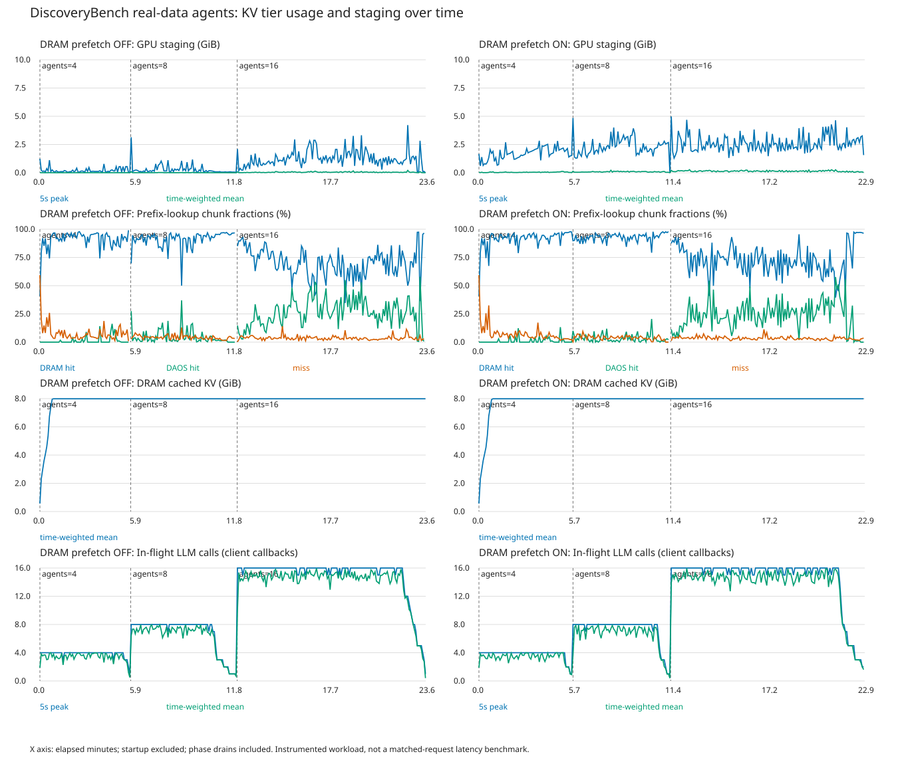

# 비동기 DRAM 캐시: GPU staging 프리페치 OFF / ON 비교

두 실행 모두 GPU-direct DAOS 쓰기, 비동기 DRAM 보관·읽기 승격, CPU hit LRU 갱신을 사용한다. 이번 ON은 여기에 DRAM→GPU staging 프리페치를 추가했다.

- Qwen3-14B BF16 / H100 NVL 한 개 / vLLM 한 프로세스 / DAOS object.
- 같은 DiscoveryBench real 32개 메타데이터의 첫 질문 순환. 실제 Python 실행 포함. 전체 데이터셋·정답 채점은 아님.
- DRAM 8GiB / 공유 staging 10GiB / 청크 128 / I/O·metadata worker 각각 16개.
- 4 agents × 5분 → 8 agents × 5분 → 16 agents × 10분. 단계별 마무리 포함.
- 각 실행은 새 프로세스·새 DAOS namespace에서 논리적 cold 시작. 데이터셋 해시와 로드한 네이티브 라이브러리 동일.
- ON의 DRAM 프리페치는 총 staging 점유가 5GiB를 넘게 되는 요청을 CPU 경로로 돌린다. DAOS는 나머지 공간을 독립적으로 사용할 수 있다.

## 시간별 비교

[PNG 원본](timeline.png) · [SVG](timeline.svg). 위에서부터 staging, tier hit, DRAM 용량, 진행 중 모델 호출. 각 열의 가로축은 해당 실행 시작 후 분이며 종료 시간이 서로 다르다.

staging 파란선은 5초 구간 최대, 초록선은 시간 가중 평균이다. 실제 활성 할당량이며 읽기·쓰기·DRAM 복사를 위해 유지하는 GPU 객체를 모두 포함한다.

## 전체 요약

| DRAM 프리페치 | 시간(분) | 작업 | 모델 호출 | DRAM hit | DAOS hit | miss | staging 최대/평균(GiB) | 평균 TTFT(ms) |
|---|---:|---:|---:|---:|---:|---:|---|---:|
| OFF | 23.60 | 287 | 2477 | 77.37% | 18.39% | 4.24% | 4.219 / 0.025 | 191.06 |
| ON | 22.90 | 306 | 2498 | 79.01% | 17.02% | 3.97% | 4.980 / 0.101 | 175.46 |

Hit의 분모는 prefix lookup 대상 청크 수다. DRAM 우선이며 DAOS에 중복 집계하지 않는다. TTFT는 기록된 값이 있는 모델 호출들의 평균이다. 실제 호출·토큰·도구 실행이 다르므로 위 TTFT 차이를 프리페치만의 속도 향상률로 해석하지 않는다.

## 단계별 관측

| DRAM 프리페치 | 동시 에이전트 | DRAM hit | DAOS hit | miss | staging 최대(GiB) |
|---|---:|---:|---:|---:|---:|
| OFF | 4 | 91.93% | 0.88% | 7.19% | 1.230 |
| OFF | 8 | 90.97% | 4.76% | 4.27% | 3.145 |
| OFF | 16 | 69.52% | 26.87% | 3.61% | 4.219 |
| ON | 4 | 92.13% | 1.19% | 6.67% | 2.832 |
| ON | 8 | 92.79% | 3.22% | 3.99% | 4.844 |
| ON | 16 | 71.73% | 24.84% | 3.43% | 4.980 |

## 실제 프리페치 및 안정성

| DRAM 프리페치 | DRAM 읽기 청크 | 미리 staging에 옮긴 청크 | staging 빈 시간 | staging 할당 실패 | 작업 완료/미완료/실패 |
|---|---:|---:|---:|---:|---|
| OFF | 105,272 | 0 | 91.01% | 0 | 246/36/5 |
| ON | 105,419 | 105,132 | 88.20% | 0 | 262/42/2 |

- OFF 도구·작업 이슈(중복 포함): `{'output_parse_error_jobs': 11, 'context_overflow_jobs': 1, 'tool_import_error_jobs': 53, 'scipy_statsmodels_compatibility_jobs': 53, 'tool_file_not_found_jobs': 0, 'iteration_limit_jobs': 24}`.
- OFF 강제 종료 5, 음수 참조/이중 해제 0, 엔진 종료 오류 0.

- ON 도구·작업 이슈(중복 포함): `{'output_parse_error_jobs': 20, 'context_overflow_jobs': 0, 'tool_import_error_jobs': 53, 'scipy_statsmodels_compatibility_jobs': 53, 'tool_file_not_found_jobs': 0, 'iteration_limit_jobs': 22}`.
- ON 강제 종료 2, 음수 참조/이중 해제 0, 엔진 종료 오류 0.

- ON 프리페치 예산 fallback은 로그 기준 3회다.
- vLLM 종료 시 backend의 최종 프리페치 카운터 로그는 남지 않았다. 위 처리량은 실행 중 trace로 확인한 수치이며 종료 카운터 누락을 0으로 간주하지 않는다.
- 일반 allocator 경고에는 CPU 캐시의 eviction 전 첫 할당 실패도 포함된다. GPU staging 할당 실패는 GPU allocator 이벤트로 별도 확인했다.

## 해석 범위

- 같은 설정·문제 목록이지만 closed-loop 실시간 에이전트이므로 실제 생성 내용·호출 순서·입력 길이·요청 수가 다를 수 있다.
- OFF는 직전 실행을 사용했고 ON을 뒤에 한 번 실행했다. 실행 순서 교대·여러 반복·고정 trace replay는 하지 않았다.
- 기존 도구의 SciPy/statsmodels 호환 오류와 모델 출력 형식 오류를 그대로 포함했다. 완료는 과학적 정답을 의미하지 않는다.
- staging 입장 기준은 공유 풀 현재 점유량을 확인하는 고정 5GiB watermark다. 자동으로 학습·변경하는 정책은 아니다.
- 각 단계는 캐시 이력이 이어지므로 동시성만의 인과 비교가 아니다. 프리페치를 켜면 CPU pin 유지 시간 및 스케줄링 변화로 hit 비율도 달라질 수 있다.
- OFF 소스와 ON 소스는 플래그 연결 코드가 다르다. 변경 파일·해시는 comparison.json에 기록했고 기본 OFF 동작은 유지했다.

## 원본

- [OFF 상세](/root/discos_minji/discovery_async_dram_20260926/RESULT_KO.md), [ON 상세](/root/discos_minji/discovery_async_dram_prefetch_20260926/RESULT_KO.md).
- [비교 집계·설정 검증](comparison.json).
