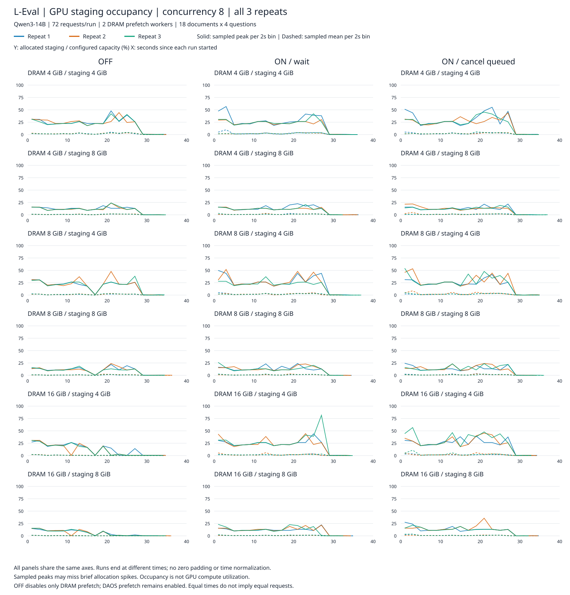
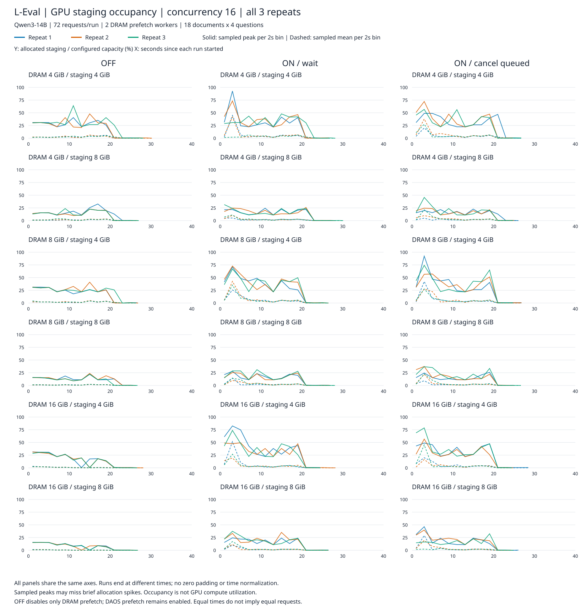
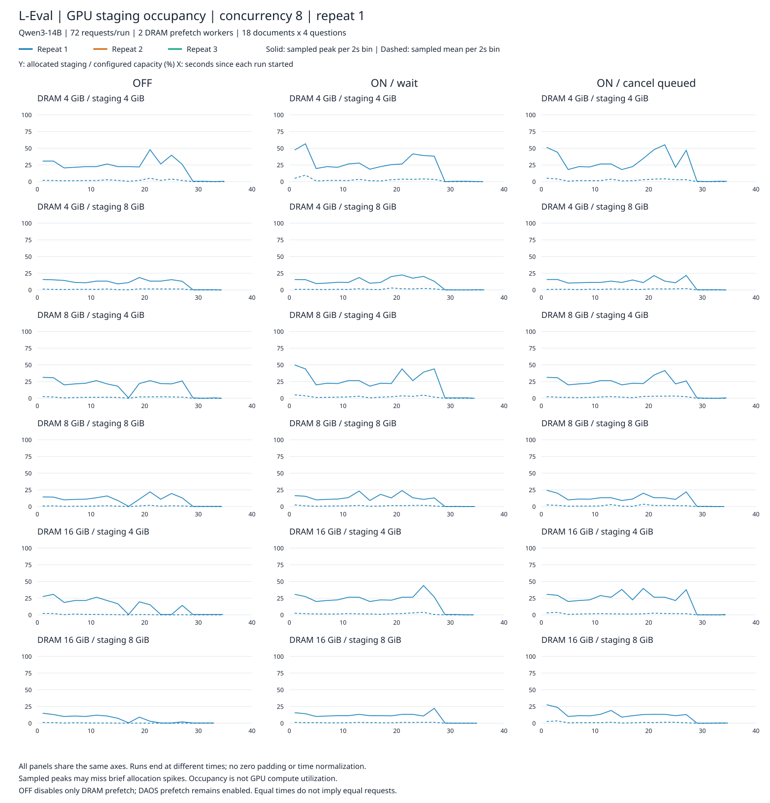
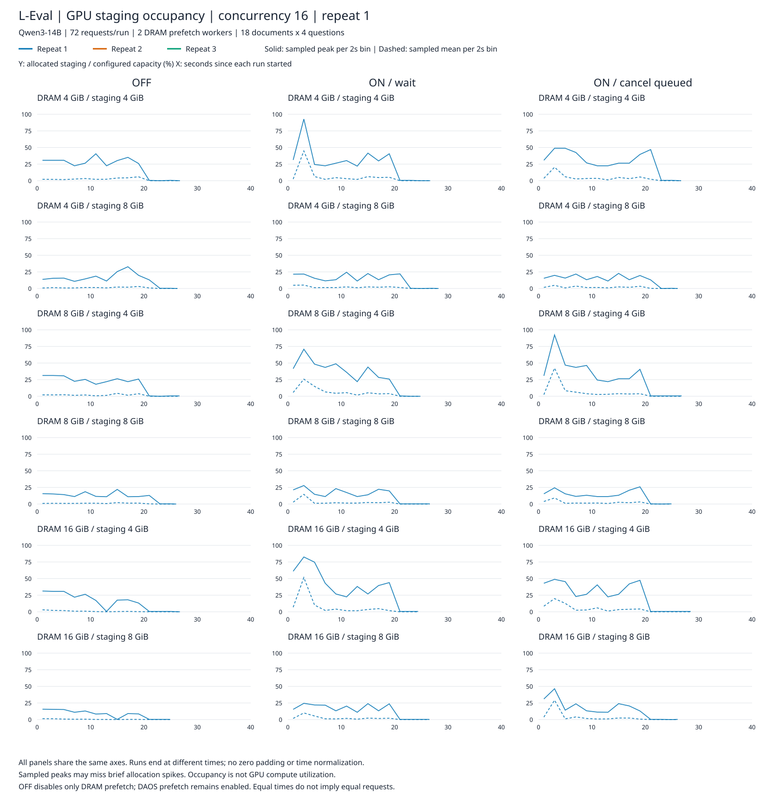
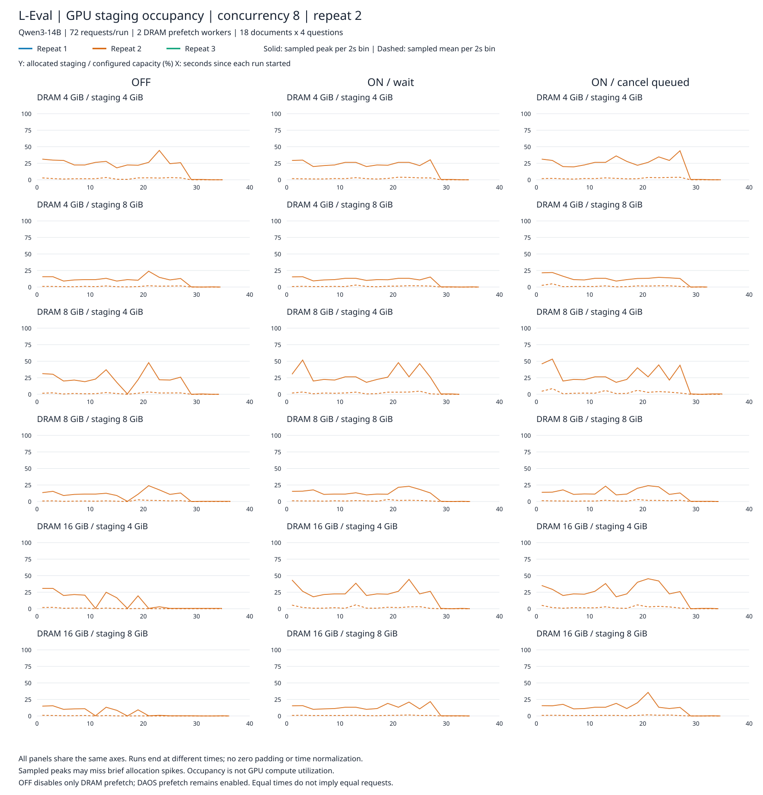
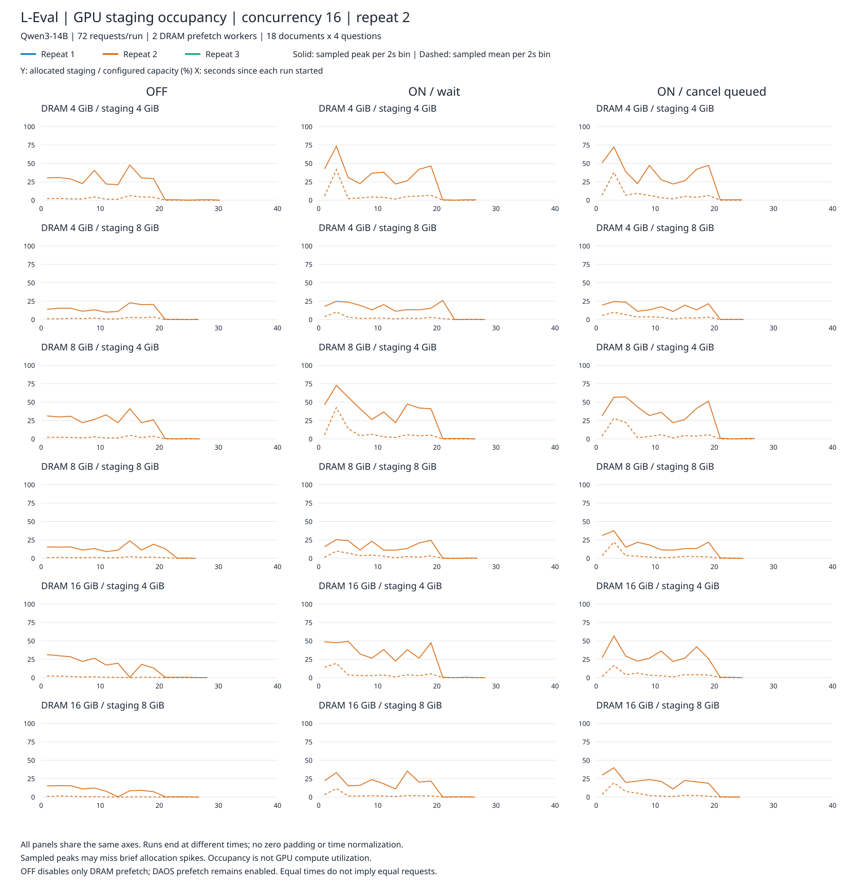
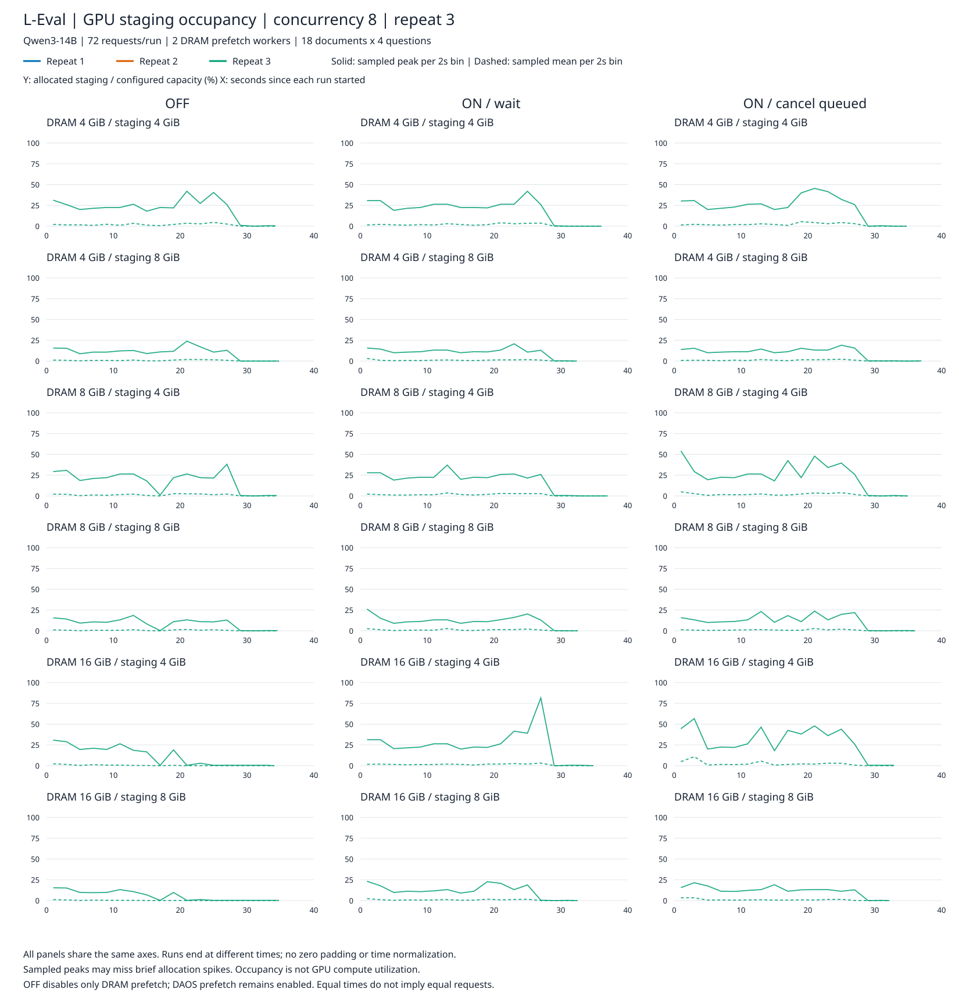
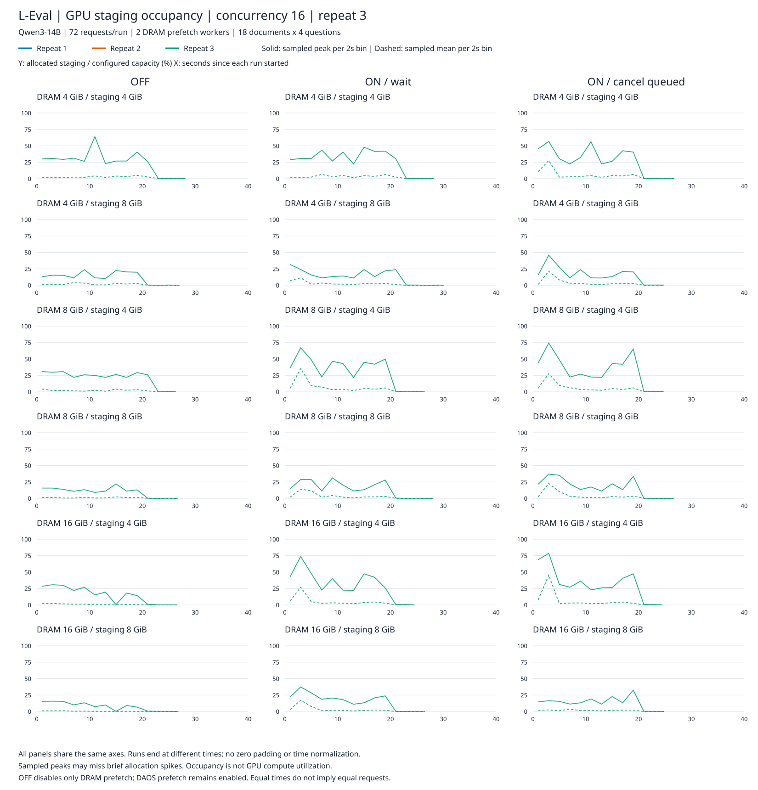

# L-Eval staging 점유율 전체 모음

36개 조건 × 3회 반복 = 108회 실행. 기존 계측 자료만 시각화했으며 실험을 재실행하지 않았다.

[전체 PDF: 8페이지](staging_all_108_runs.pdf)

- 1~2페이지: 동시 요청 8/16, 3회 반복을 겹쳐 표시.
- 3~8페이지: 반복 1/2/3 각각의 동시 요청 8/16 그래프.
- 행: DRAM 4/8/16GiB × staging 4/8GiB. 열: OFF / ON / ON+대기열 취소.
- 색상: 파랑=1회, 주황=2회, 초록=3회. 실선=2초 구간 표본 최댓값, 점선=표본 평균.
- 모든 패널의 Y축은 0~100%, X축은 동일한 실제 경과 시간(초). 마지막 구간은 실행 종료 시각으로 제한했다.
- 반복을 평균내지 않았고 종료 후 0을 추가하지 않았다. 같은 시각에 같은 요청이 진행된다는 뜻은 아니다.
- 샘플 사이에 일어난 순간 할당 피크는 빠질 수 있다. 요약표의 이벤트 기반 최대 점유율과 다를 수 있다.
- OFF는 DRAM 프리페치만 끈 상태. 점유율은 GPU 연산 사용률이 아니다.

원본: 각 실행의 `timeline_bins.json` 및 `summary.json`.

## staging_c8_all_repeats

## staging_c16_all_repeats

## staging_c8_r1

## staging_c16_r1

## staging_c8_r2

## staging_c16_r2

## staging_c8_r3

## staging_c16_r3

