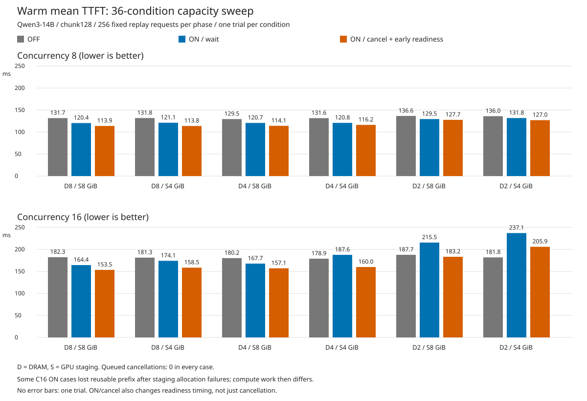

# 36조건 프리페치 실험: 결과와 해석

2026-09-27, `/root/discos_minji`, client-5. 요청한 36조건 모두 완료했다. HTTP 요청 오류 없이 총 18,432개 요청을 처리했고, 실험용 vLLM 프로세스는 종료했다.

## 무엇을 비교했나

- 동시 요청: 8 / 16.
- DRAM: 8 / 4 / 2GiB. GPU staging: 8 / 4GiB.
- OFF: **DRAM 프리페치만 OFF**. DRAM 캐시 보관과 DAOS 프리페치는 유지한다.
- ON/취소 OFF(`wait`): 기존 DRAM 프리페치 동작.
- ON/취소 ON(`cancel`): retrieve 시 아직 실행되지 않은 작업이면 취소하고 DRAM 경로를 사용하는 기능. **CPU 데이터 준비를 일찍 알리는 변경도 함께 포함**한다.

Qwen3-14B BF16, 청크 128, DAOS object 경로를 사용했다. DiscoveryBench에서 기록해 둔 동일 입력 256개를 재생했다. 모델 추론은 실제 실행하지만 이번 실험에서 Python 분석 도구를 실행하거나 문제 풀이 정답을 채점하지는 않는다.

조건마다 **새 프로세스·빈 DRAM·새 DAOS namespace → cold 256개 → 비동기 저장 완료 확인 → 동일 프로세스/캐시에서 warm 256개** 순서다. 조건 사이에는 DRAM을 초기화하지만 한 조건의 cold와 warm 사이에는 비우지 않는다. 새 namespace는 이전 캐시를 논리적으로 격리하며, DAOS 서버 전체를 초기화하는 뜻이 아니다.

입력 순서와 개수는 동일하다. rolling 방식으로 처음 8/16개를 투입하고 하나가 완료되면 다음 하나를 넣는다. 묶음 전체가 끝날 때까지 기다리지 않는다. 따라서 실제 도착 시각과 생성 길이는 실행마다 달라질 수 있다. 실험별 cold/warm은 각 1회이며, 반복 오차나 유의성을 검증한 결과는 아니다.

별도 staging 점유율 상한이나 DAOS용 예약 공간은 추가하지 않았다. 물리적 할당 실패 시 기존 fallback을 사용한다. 36조건 모두 모델용 KV 공간은 로그상 40.92GiB / 268,176토큰으로 같았고, 로드한 DAOS/libfabric 라이브러리도 같았다.

## Warm 평균 TTFT

단위는 ms이며 낮을수록 빠르다. 메모리 단위는 GiB다. `취소 ON` 열은 순수 취소 효과가 아니라 조기 준비 알림까지 포함한 구현의 결과다.

|동시 요청|DRAM|staging|프리페치 OFF|ON / 취소 OFF|ON / 취소 ON|
|---:|---:|---:|---:|---:|---:|
|8|8|8|131.68|120.44|113.89|
|8|8|4|131.77|121.14|113.81|
|8|4|8|129.47|120.71|114.10|
|8|4|4|131.59|120.84|116.24|
|8|2|8|136.55|129.48|127.70|
|8|2|4|136.05|131.77|127.00|
|16|8|8|182.34|164.42|153.52|
|16|8|4|181.32|174.08|158.52|
|16|4|8|180.20|167.71|157.10|
|16|4|4|178.90|187.64|159.96|
|16|2|8|187.70|215.49|183.21|
|16|2|4|181.81|237.09|205.92|

## 핵심 관측 1: 공간 부족으로 재사용을 잃는 경우가 나왔다

동시 요청 8개에서는 모든 warm 조건에서 DAOS staging 할당 실패로 인한 추가 재계산이 0이었다. 동시 요청 16개의 일부 ON 조건에서는 발생했다. 아래는 **0이 아닌 조건만**이다.

|동시 요청|DRAM|staging|방식|영향 요청 / 256|추가 재계산 토큰|전체 입력 대비|staging peak GiB|
|---:|---:|---:|---|---:|---:|---:|---:|
|16|8|4|ON / 취소 OFF|3|1,408|0.089%|3.984|
|16|4|4|ON / 취소 OFF|5|4,864|0.308%|3.984|
|16|2|8|ON / 취소 OFF|3|9,216|0.584%|7.988|
|16|2|8|ON / 취소 ON|1|1,920|0.122%|7.988|
|16|2|4|ON / 취소 OFF|9|13,824|0.876%|3.984|
|16|2|4|ON / 취소 ON|6|8,192|0.519%|3.984|

모든 OFF warm 조건 및 모든 cold 조건에서는 이 원인의 추가 재계산이 0이었다. cold의 일반 캐시 miss에 따른 계산은 별도로 존재하며, 위 비율에 포함하지 않는다.

이 수치는 단순히 `전체 입력 - cache hit`를 용량 부족이라고 간주한 것이 아니다. DAOS lookup의 존재 확인, 읽기 중 GPU allocator 실패, 반환한 연속 prefix 길이, 실제 vLLM cached token 수를 요청별로 대조했다. 실패 지점 뒤에서 이미 읽은 청크도 연속 prefix로 사용할 수 없어 버릴 수 있으므로, 추가 재계산량은 실패한 청크 수와 다르다.

예를 들어 16개·DRAM 2GiB·staging 4GiB에서:

- OFF: 평균 TTFT 181.81ms, p95 509.54ms, 추가 재계산 0.
- ON/취소 OFF: 평균 237.09ms(+30.4%), p95 1,493.16ms, 9개 요청에서 13,824토큰 추가 재계산.
- ON/취소 ON: 평균 205.92ms(+13.3%), p95 1,023.40ms, 6개 요청에서 8,192토큰 추가 재계산.

따라서 이 조건에서는 **DRAM 선행 복사가 사용하는 staging 공간과 DAOS 읽기의 공간 수요를 함께 관리할 필요가 있다는 근거**를 얻었다. 다만 TTFT 증가분 전부를 이 요인 하나로 정량 귀속하거나, 항상 같은 증가율이 나온다고 단정할 수는 없다.

staging 그래프의 구간 평균이 낮아 보여도 순간 할당 실패가 발생할 수 있다. 위 peak는 이벤트 기록 기준이고, 시간 그래프는 약 20ms 주기 표본을 2초 구간의 평균/최댓값으로 묶었다. 짧은 급증은 평균에 희석되거나 표본 사이에 놓칠 수 있다.

## 핵심 관측 2: 이번에도 대기 중 취소는 0건

36조건의 cold/warm 전체에서 `retrieve_cancelled_queued=0`이었다. 취소 ON 조건의 처리 결과 합계는 GPU 준비 완료 6,035회, 이미 시작한 작업을 기다림 7회, staging 공간 부족으로 CPU 경로 사용 41회였다. 취소 설정은 적용됐지만 retrieve 시 취소할 수 있는 queued 상태를 만난 경우가 없었다.

그러므로 ON/취소 ON이 빠른 경우를 **대기열에서 작업을 취소했기 때문이라고 설명하면 안 된다.** 이 구현은 조기 준비 알림과 프리페치 coroutine/serializer 구간도 바꾼다. 이번 36조건에는 조기 준비 알림만 켜고 취소를 끈 별도 대조군이 없으므로, 그 변화의 효과 역시 분리해 확정할 수 없다.

## 핵심 관측 3: DRAM 2GiB에서 DAOS 비중이 크게 증가

warm lookup 기준으로 다음 범위였다. ON/OFF 및 동시성에 따라 값이 조금씩 다르다.

|DRAM|DRAM hit 비율|DAOS hit 비율|
|---:|---:|---:|
|8GiB|약 92.4~92.6%|약 7.4~7.6%|
|4GiB|약 87.2~88.0%|약 12.0~12.8%|
|2GiB|약 45.8~48.6%|약 51.4~54.2%|

분모는 최초 DRAM 조회 후보 청크 수이고, 분자는 각 tier의 lookup hit 청크 수다. **DAOS hit는 저장소에 존재한다는 뜻이지 staging 적재와 최종 재사용까지 성공했다는 뜻은 아니다.** 공간 부족 후 재계산이 생겨도 lookup hit 비율은 높게 나올 수 있다.

## 해석 시 주의

- cold는 같은 실행 중 캐시가 채워지므로 요청마다 miss량이 달라진다. OFF/ON cold 시간을 순수 복사 경로 차이로 보지 않는다.
- warm에서도 DRAM 배치와 도착 시각이 완전히 같지는 않다. 용량 실패가 없는 조건은 요청별 실제 cached token 수가 같았지만, 위 실패 조건은 추가 계산량까지 달라졌다. 이번 목적이 공간 경쟁의 부작용을 보는 것이라면 그 차이도 결과다.
- 전체 완료 시간과 TTFT는 다른 지표다. 위 16/D2/S4의 OFF·wait·cancel 완료 시간은 93.85 / 91.92 / 90.92초이고 생성량도 70,035 / 68,930 / 68,259토큰으로 다르다. 이를 근거로 전체 처리 성능의 우열을 확정하지 않는다.
- 한 번씩의 측정이다. 후속으로 동일 조건 반복·순서 교차, 조기 준비 알림 단독 대조군, 요청별 staging 소유/실패 타임라인을 확인하면 원인과 변동 폭을 더 엄밀히 구분할 수 있다.

## 결과 파일

- [전체 cold/warm 표](RESULT_KO.md), [CSV](summary.csv), [구조화 요약](summary.json).
- [72개 시간 그래프 바로가기](GRAPH_INDEX_KO.md), [TTFT 비교 PNG](warm_ttft_comparison.png), [SVG](warm_ttft_comparison.svg).
- [요청별 재사용량 비교](paired_checks.json), [검증 결과](validation.json), [실행 계획·소스 해시](plan.json).
- 각 조건의 `cold/`·`warm/` 아래 `replay_calls.json`, `timing_by_request.json`, `retrieve_decisions.json`에 원본 요청 결과와 대조 기록이 있다.

## 사전 정리 및 남은 공간

승인받은 과거 실험 namespace 30개에서 KV 키 68,814개를 삭제했고, 나머지 키 15,083개의 집합은 그대로 보존했다. 로그·그래프·코드와 기본 namespace는 삭제하지 않았다. 삭제한 KV payload의 백업은 없으며 재계산으로 다시 만들어야 한다. [정리 기록](../namespace_cleanup_20260927/RESULT_KO.md).

정리 후 NVMe 여유 공간은 약 1.60TB였다. 이번 36조건이 모두 끝난 시점에는 약 347.87GB, 가장 여유가 적은 타깃은 약 19.26GB였다. 새 실험 namespace는 보존했다. 추가 대규모 실험 전에는 다시 용량을 확인해야 한다.
