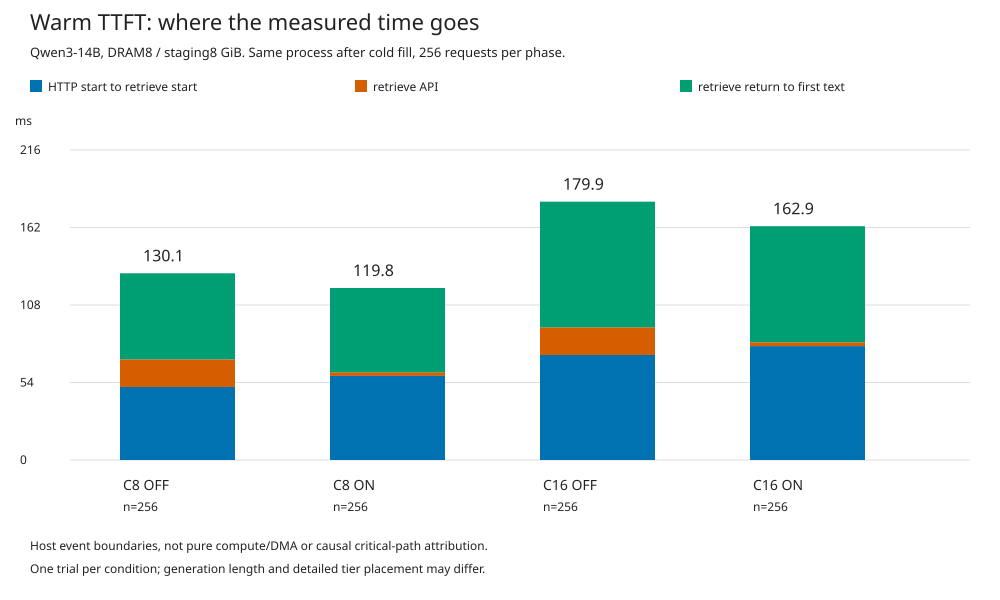

# Cold 1회 → 같은 프로세스에서 Warm 1회: DRAM 프리페치 비교

Qwen3-14B BF16, DRAM/staging 각각 8GiB, 청크128, DAOS object. 각 OFF/ON·동시 요청 조건마다 새 프로세스·빈 DRAM·독립 DAOS namespace로 시작했다. 동일한 DiscoveryBench 기록 입력 256개를 cold로 실행한 뒤 저장/복사가 끝나고 staging이 비었음을 확인하고, 프로세스와 DRAM/DAOS 캐시를 유지한 채 같은 256개를 warm으로 재생했다. 원래 Python 도구를 실행하는 full agentic 벤치마크는 아니다.

rolling 투입: 처음 N개를 함께 보내고 이후 하나가 끝날 때마다 하나를 보충한다. DAOS 프리페치, 새 KV 저장, 비동기 DRAM 저장·읽기 승격, 실제 용량 제한은 모두 유지했다. DRAM 프리페치만 OFF/ON으로 바꿨다. 최대 생성 2048토큰과 기존 EOS/Observation 종료 조건을 유지했으므로 생성량과 정확한 도착 시점은 달라질 수 있다.

**warm도 DRAM all-hit 또는 ON/OFF 동일 hit를 보장하지 않는다.** 아래 실제 hit와 계산량을 확인해야 한다. 단계별 1회이며 반복 실험의 통계적 우열을 주장하지 않는다. 서버/OS 캐시는 flush하지 않았다.

| 동시 요청 | 프리페치 | 단계 | 평균 TTFT ms | p95 TTFT ms | 전체 s | DRAM hit % | DAOS hit % | 새로 계산한 입력 토큰 | 생성 토큰 |
|---:|---|---|---:|---:|---:|---:|---:|---:|---:|
| 8 | OFF | cold | 218.35 | 292.10 | 148.19 | 90.30 | 1.07 | 151750 | 68530 |
| 8 | OFF | warm | 130.06 | 174.76 | 141.46 | 92.61 | 7.39 | 17097 | 69116 |
| 8 | ON | cold | 212.00 | 272.00 | 146.89 | 90.25 | 1.11 | 151878 | 68272 |
| 8 | ON | warm | 119.82 | 166.26 | 135.93 | 92.52 | 7.48 | 17097 | 67802 |
| 16 | ON | cold | 409.00 | 2965.55 | 99.44 | 88.89 | 1.02 | 174534 | 67508 |
| 16 | ON | warm | 162.86 | 419.03 | 89.92 | 92.42 | 7.58 | 17097 | 68851 |
| 16 | OFF | cold | 429.15 | 3739.66 | 103.04 | 88.91 | 1.10 | 173126 | 68172 |
| 16 | OFF | warm | 179.94 | 542.04 | 91.65 | 92.44 | 7.56 | 17097 | 68179 |

hit 비율의 분모는 최초 DRAM tier에서 조회한 전체 후보 청크 수이며 DRAM/DAOS에 동일 분모를 사용했다. 새로 계산한 입력은 HTTP prompt_tokens − cached_tokens로, cold miss와 청크 경계 등을 포함한다. staging 부족으로 잃은 prefix 재계산과는 별도다. TTFT는 클라이언트의 첫 텍스트 수신 기준이다.

## 복사 대기·retrieve·메모리

| 조건 | 단계 | 복사 큐 평균 ms | 복사 함수 평균 ms | retrieve 평균 ms | 최대 staging GiB | DRAM 시작 GiB | 공간 부족 fallback | DAOS 실패 재계산 토큰 |
|---|---|---:|---:|---:|---:|---:|---:|---:|
| c8_off | cold | — | — | 19.004 | 1.230 | 0.000 | 0 | 0 |
| c8_off | warm | — | — | 19.264 | 1.113 | 7.988 | 0 | 0 |
| c8_on | cold | 0.373 | 16.878 | 2.376 | 2.520 | 0.000 | 0 | 0 |
| c8_on | warm | 0.443 | 18.283 | 2.535 | 5.000 | 7.988 | 0 | 0 |
| c16_on | cold | 0.842 | 16.935 | 2.423 | 4.551 | 0.000 | 0 | 0 |
| c16_on | warm | 1.669 | 18.459 | 2.670 | 7.988 | 7.988 | 3 | 0 |
| c16_off | cold | — | — | 18.763 | 1.230 | 0.000 | 0 | 0 |
| c16_off | warm | — | — | 19.285 | 1.113 | 7.988 | 0 | 0 |

복사 함수는 호스트 경과 시간이며 enqueue와 기존 stream 대기를 포함한다. 각 열의 대상 요청 수가 달라질 수 있으므로 합계를 TTFT로 해석하면 안 된다. 큐·복사 계측 때문에 GPU 동기화를 추가하지 않았다.

## ON/OFF 실제 재사용량 일치 여부

| 동시 요청 | 단계 | 동일 재사용 토큰 요청 /256 | DRAM·DAOS hit도 같은 요청 /256 |
|---:|---|---:|---:|
| 8 | cold | 249 | 247 |
| 8 | warm | 256 | 253 |
| 16 | cold | 236 | 235 |
| 16 | warm | 256 | 250 |

## Warm TTFT가 어느 구간에서 달라졌는가

아래는 같은 HTTP 요청의 시작, retrieve API 시작/반환, 첫 텍스트 수신 경계를 연결한 것이다. retrieve 전 구간은 서버 처리·lookup·비동기 읽기·스케줄 대기를 포함하고, 이후 구간도 모델 계산만이 아니라 스케줄 및 응답 전달을 포함한다. 인과적인 순수 계산/통신 시간 분해는 아니다.

| 조건 | 요청 시작→retrieve 시작 ms | retrieve ms | retrieve 반환→첫 텍스트 ms | TTFT ms | 대상 요청 수 |
|---|---:|---:|---:|---:|---:|
| c8_off | 50.862 | 19.264 | 59.933 | 130.059 | 256 |
| c8_on | 58.567 | 2.535 | 58.720 | 119.822 | 256 |
| c16_on | 79.340 | 2.670 | 80.850 | 162.860 | 256 |
| c16_off | 73.142 | 19.285 | 87.513 | 179.939 | 256 |

[현재 코드의 준비 완료·스케줄링 경로 메모](CONTROL_PATH_NOTES_KO.md)

서버 지표는 각 단계 앞뒤의 누적 histogram 차이로 계산해 warm 값에 cold가 섞이지 않게 했다. 초기 모델 로딩과 단계 사이 drain은 전체 시간에서 제외했다. cold는 반드시 모든 요청이 miss라는 뜻이 아니라 출발 상태가 비어 있다는 뜻이다.

[전체 지표](summary.json) · [요청별 일치 검사](paired_checks.json) · [검증](validation.json)
