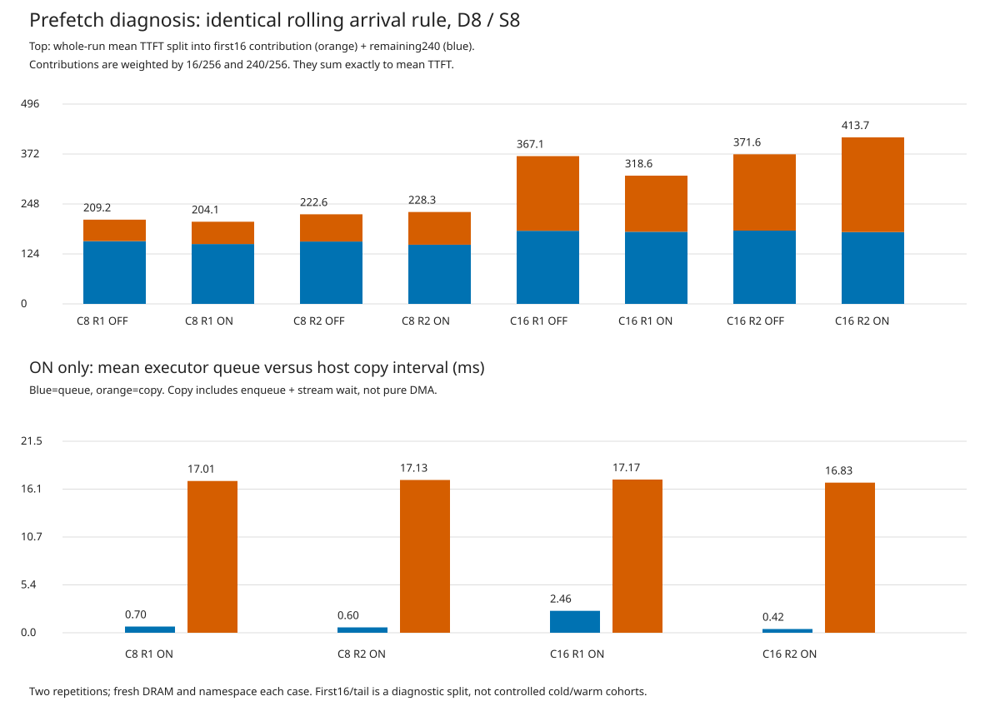

# 프리페치 대기열·복사·retrieve 진단

Qwen3-14B, DRAM 8GiB / staging 8GiB, chunk128, object 경로. 같은 기록 입력 256개를 rolling 방식으로 투입했다. 각 조건 새 프로세스·빈 DRAM·독립 DAOS namespace. ON/OFF는 DRAM 프리페치만 변경한다. DAOS 프리페치와 DRAM 비동기 저장/승격은 유지한다. Python 도구 실행 없는 기록 재생이다.

조건별 2회, 순서를 반대로 배치했다. 생성 EOS를 유지하여 생성량과 이후 도착 시점·캐시 hit가 완전히 같지는 않다. 첫 16개/나머지 240개는 초기 구간 영향을 보기 위한 보조 분석이며, 나머지가 동일한 warm 상태라는 뜻은 아니다.

## 전체 결과

| 실행 | 평균 TTFT ms | 첫 16개 ms | 나머지 240개 ms | 전체 s | 생성 토큰 | 공간 부족 fallback | 최대 staging GiB |
|---|---:|---:|---:|---:|---:|---:|---:|
| r1_c8_off | 209.22 | 852.69 | 166.33 | 148.66 | 68129 | 0 | 1.230 |
| r1_c8_on | 204.09 | 886.36 | 158.60 | 147.37 | 68090 | 0 | 3.027 |
| r1_c16_on | 318.58 | 2230.19 | 191.14 | 97.29 | 67592 | 0 | 7.637 |
| r1_c16_off | 367.09 | 2967.89 | 193.71 | 101.78 | 68072 | 0 | 1.230 |
| r2_c16_off | 371.62 | 3033.79 | 194.15 | 101.76 | 68017 | 0 | 1.113 |
| r2_c16_on | 413.67 | 3763.61 | 190.34 | 100.89 | 68690 | 0 | 3.984 |
| r2_c8_on | 228.27 | 1300.50 | 156.79 | 147.74 | 68091 | 0 | 3.164 |
| r2_c8_off | 222.57 | 1082.68 | 165.23 | 151.35 | 69341 | 0 | 1.133 |

## 요청별 시간 계측

각 칸은 평균 / p95(ms). 해당 이벤트가 있는 요청만의 통계이므로 서로 다른 열을 더해 TTFT로 해석하면 안 된다.

| 실행 | executor 대기 | reserve | H2D copy 호출 | CPU 준비→retrieve | retrieve API |
|---|---:|---:|---:|---:|---:|
| r1_c8_off | — | — | — | 30.789 / 56.064 | 19.073 / 40.931 |
| r1_c8_on | 0.696 / 0.443 | 1.211 / 2.695 | 17.013 / 37.000 | 19.214 / 30.672 | 2.422 / 4.780 |
| r1_c16_on | 2.458 / 21.451 | 1.211 / 2.621 | 17.175 / 37.065 | 31.366 / 77.444 | 2.445 / 4.974 |
| r1_c16_off | — | — | — | 50.977 / 108.609 | 18.984 / 40.953 |
| r2_c16_off | — | — | — | 44.186 / 91.317 | 19.200 / 41.177 |
| r2_c16_on | 0.418 / 0.749 | 1.273 / 2.696 | 16.830 / 36.848 | 83.001 / 85.586 | 2.378 / 4.775 |
| r2_c8_on | 0.602 / 0.502 | 1.235 / 2.532 | 17.127 / 36.867 | 17.684 / 26.283 | 2.432 / 4.806 |
| r2_c8_off | — | — | — | 36.450 / 54.950 | 18.937 / 41.033 |

## 서버 측 보조 지표

서버 histogram 합계/횟수. 서버 큐 시간은 DRAM 복사 executor 큐와 다른 지표다. 서버 prefill 시간도 순수 GPU 연산 시간으로 해석하지 않는다.

| 실행 | 서버 TTFT ms | 서버 큐 ms | 서버 prefill ms | 미재사용 입력 토큰 |
|---|---:|---:|---:|---:|
| r1_c8_off | 173.82 | 47.79 | 105.54 | 144454 |
| r1_c8_on | 167.59 | 57.70 | 91.84 | 146886 |
| r1_c16_on | 271.28 | 132.11 | 113.77 | 149062 |
| r1_c16_off | 307.28 | 124.08 | 158.80 | 159302 |
| r2_c16_off | 307.65 | 130.30 | 152.77 | 159686 |
| r2_c16_on | 335.41 | 148.71 | 163.05 | 177606 |
| r2_c8_on | 184.58 | 61.67 | 104.07 | 158406 |
| r2_c8_off | 177.69 | 42.51 | 116.18 | 151110 |

## 초기 16개 요청의 실제 캐시 재사용량

모든 실행은 빈 DRAM에서 시작했지만, 최초 동시 요청들 사이에서도 먼저 처리된 요청이 저장한 캐시를 후속 lookup이 재사용한다. 따라서 시작 상태가 같다는 것과 각 요청의 hit가 같다는 것은 다르다. 동일한 클라이언트 입력 목록도 실제 서버 도착·lookup·store 완료 순서를 고정하지는 않는다.

| 실행 | 첫 16개 재사용 토큰 | 첫 16개 미재사용 토큰 | 첫 16개 TTFT ms |
|---|---:|---:|---:|
| r1_c8_off | 51840 | 24850 | 852.69 |
| r1_c8_on | 50560 | 26130 | 886.36 |
| r1_c16_on | 48896 | 27794 | 2230.19 |
| r1_c16_off | 37888 | 38802 | 2967.89 |
| r2_c16_off | 37120 | 39570 | 3033.79 |
| r2_c16_on | 20864 | 55826 | 3763.61 |
| r2_c8_on | 37888 | 38802 | 1300.50 |
| r2_c8_off | 45312 | 31378 | 1082.68 |

미재사용 토큰에는 정상 cold miss가 포함된다. staging 부족 재계산 토큰과 혼동하면 안 된다. 이 차이는 초기 계산량 차이의 직접적인 근거지만, hit 차이가 생긴 세부 스케줄링 원인을 전부 규명한 것은 아니다.

### 공유 prefix와 처리 순서의 실제 사례

처음 16개 입력에는 같은 문제의 여러 대화 턴이 함께 들어 있다. 예를 들어 요청 0과 5의 프롬프트 문자열 전체는 더 긴 요청 11과 12의 앞부분이다. 이 기록 재생기는 원래 에이전트의 턴 간 의존성을 재현하지 않고 각 프롬프트를 독립 요청으로 보낸다. 동시 16개에서는 이 네 요청이 초기 투입에 모두 포함된다. 동일한 입력 목록·도착 규칙이 서버의 실제 lookup/store 순서를 고정하지는 않는다.

| 요청 index | 16개 ON 반복1 캐시 hit 토큰 | 16개 ON 반복2 캐시 hit 토큰 |
|---:|---:|---:|
| 0 | 7808 | 1408 |
| 5 | 8064 | 1408 |
| 11 | 0 | 1408 |
| 12 | 8704 | 1408 |

반복1에서 요청 11의 첫 lookup 결과는 초기 HTTP 투입 약 45ms 후였고 캐시 hit=0토큰이었다. 요청 0은 약 1845ms 후였으며 캐시 hit=7,808토큰이었다. 위 표의 반복 간 차이는 복사 대기열 길이만으로 비교할 수 없을 만큼 입력 계산량이 달라졌다는 직접적인 근거다. 어떤 요청이 각 키를 최초 저장했는지까지 키 단위로 추적한 것은 아니므로 저장 주체의 인과 연결은 확정하지 않는다.

[공유 prefix·요청별 hit·lookup 시점 근거](shared_prefix_evidence.json)

## 이전 16개 rolling 실험의 평균이 상쇄된 위치

아래는 이번 재실험이 아니라 이전 3회 실행을 원본 HTTP 기록으로 다시 계산한 값이다. 계측을 추가한 새 결과와 혼합 평균하지 않았다.

| 반복 | OFF 전체 ms | ON 전체 ms | OFF 첫 16개 ms | ON 첫 16개 ms | OFF 나머지 ms | ON 나머지 ms |
|---:|---:|---:|---:|---:|---:|---:|
| 1 | 358.62 | 371.47 | 2862.71 | 3094.78 | 191.68 | 189.92 |
| 2 | 399.00 | 380.63 | 3313.83 | 3311.55 | 204.67 | 185.24 |
| 3 | 397.62 | 419.65 | 3292.61 | 3918.81 | 204.62 | 186.38 |

3회 모두 나머지 240개 구간에서는 ON의 평균 TTFT가 낮았지만, 첫 16개 구간의 지연이 전체 평균의 이득을 상쇄했다. 이는 **어느 구간에서 상쇄됐는지**를 보여주며, 초기 지연의 세부 원인이나 순수 프리페치 인과효과를 확정하는 분석은 아니다. 첫 16개에서도 동시 요청 간 캐시 재사용이 발생하고 그 양이 달랐다.

## 해석의 경계

- executor 대기: submit 직전→worker 함수 진입. 제출/dispatch 오버헤드도 포함한다.
- copy: 기존 H2D 복사 함수의 호스트 경과 시간. enqueue와 stream.synchronize 대기를 포함하며 순수 DMA 시간이 아니다.
- CPU 준비→retrieve: 이미 준비된 데이터가 실제 retrieve API 진입까지 보유된 시간. 양수여도 그만큼 성능이 개선됐다는 뜻은 아니다. 프리페치 완료가 스케줄러의 실행 허용 조건일 수 있어 retrieve 시점 자체가 뒤로 이동할 수 있다.
- retrieve: API 시작→반환. 모델 계산 전체가 아니다. TTFT는 클라이언트에서 첫 텍스트를 받은 시점이다.
- 사건 기록 오버헤드가 존재한다. 추가 GPU 동기화·복사·스케줄링 정책 변경은 없다.
- fallback은 공간 부족 시 기존 DRAM 객체를 반환하는 것으로, cache miss/재계산과 다르다.
- 전체 평균에서 차이가 작다고 프리페치 자체가 동작하지 않았다고 결론 내리지 않는다.

[요약 원본](timing_summary.json). 각 실행의 timing_by_request.csv/json에 요청별 근거를 보존했다.

