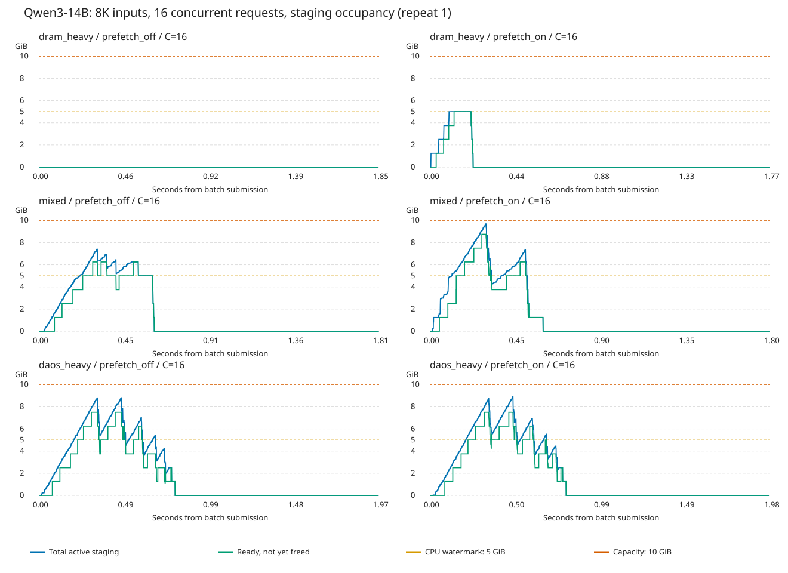

# DRAM/DAOS 혼합 부하의 GPU staging 점유 측정

2026-09-23. 실제 object GPU-direct 경로. 합성 부하 진단이며 DiscoveryBench가 아니다.

## 핵심 관측

- 요청 수가 같아도 DRAM hit가 많으면 DAOS가 쓰는 staging이 줄어든다. OFF의 DRAM-only 재사용은 staging 점유가 0이었다.
- ON, 동시성 16, DRAM hit 100%: 최대 5.00GiB. 두 묶음 32요청 중 8개만 staging으로 미리 복사했고 24개는 CPU 직접 로드로 돌아갔다. 기존 5GiB admission 제한이 적용됐다.
- ON, 동시성 16, DRAM/DAOS 50:50: 순간 최대 9.69GiB/10GiB. CPU 입장 기준이 5GiB여도 DAOS가 이후 독립적으로 공간을 사용할 수 있어 전체 사용량은 이를 넘는다.
- 따라서 DAOS 수요가 낮을 때 CPU 프리페치 한도를 빌려주는 정책의 실험 근거가 된다. 다만 5GiB를 넘겨 허용하는 동적 정책 자체는 구현/비교하지 않았고, 이를 바꾸면 지연이 더 좋아진다는 증거는 아직 아니다.

## 실행 조건

- Qwen/Qwen3-14B BF16, H100 NVL 1개, vLLM 서버 1개, 자체 prefix caching OFF.
- 입력 16종 × 8192토큰, 출력 64토큰. 청크 128, DRAM 4GiB, GPU staging 10GiB.
- DRAM 프리페치 OFF/ON 별 새 프로세스·새 DAOS namespace. ON의 기존 입장 기준은 공유 풀 5GiB.
- 순차 fill 후 최근 입력 2종을 DRAM-hot으로 선택, 앞 입력 8종은 DAOS-only로 확인.
- 각 측정 묶음은 16요청. DRAM-heavy는 hot 2종을 반복, DAOS-heavy는 cold 8종을 반복, mixed는 둘을 반씩 사용.
- 세 workload의 입력 다양성이 다르므로 workload 사이 시간 차이를 순수 hit 비율 효과로 단정하지 않는다.
- 동시성 1/4/8/16, 프로세스 안에서 2회 반복. OFF→ON 실행 순서는 고정이며 독립 반복 성능 검증이 아니다.
- 준비 이후 요청은 기존 lmcache.skip_save 설정으로 새 저장을 생략. fill 1024청크의 DAOS 저장 완료와 staging 0 복귀 확인.
- 측정 중 생성 결과를 다음 입력에 추가하지 않으며, 캐시 보관/퇴거/프리페치 정책은 바꾸지 않았다.

## staging 점유와 지연

최대는 두 묶음의 event-wise 최대, 평균은 전체 HTTP 묶음 시간 가중 평균이다. 평균에는 staging이 비어 있는 decode 시간도 포함하므로 모든 여유를 프리페치에 쓸 수 있다는 뜻이 아니다.

| 프리페치 | 부하 | 동시성 | DRAM hit 비중 | 최대 GiB | 평균 GiB | 평균 TTFT ms | CPU staging/미사용 요청 |
|---|---|---:|---:|---:|---:|---:|---:|
| OFF | DAOS 위주 | 1 | 0% | 1.250 | 0.068 | 97.51 | 0/0 |
| OFF | DAOS 위주 | 4 | 0% | 3.477 | 0.439 | 212.17 | 0/0 |
| OFF | DAOS 위주 | 8 | 0% | 5.645 | 0.805 | 334.93 | 0/0 |
| OFF | DAOS 위주 | 16 | 0% | 8.809 | 1.875 | 682.85 | 0/0 |
| OFF | DRAM 위주 | 1 | 100% | 0.000 | 0.000 | 71.04 | 0/32 |
| OFF | DRAM 위주 | 4 | 100% | 0.000 | 0.000 | 198.49 | 0/32 |
| OFF | DRAM 위주 | 8 | 100% | 0.000 | 0.000 | 363.92 | 0/32 |
| OFF | DRAM 위주 | 16 | 100% | 0.000 | 0.000 | 666.79 | 0/32 |
| OFF | 혼합 | 1 | 50% | 1.250 | 0.036 | 84.96 | 0/16 |
| OFF | 혼합 | 4 | 50% | 2.500 | 0.194 | 190.70 | 0/16 |
| OFF | 혼합 | 8 | 50% | 5.000 | 0.618 | 349.02 | 0/16 |
| OFF | 혼합 | 16 | 50% | 7.539 | 1.514 | 650.88 | 0/16 |
| ON | DAOS 위주 | 1 | 0% | 1.250 | 0.065 | 94.59 | 0/0 |
| ON | DAOS 위주 | 4 | 0% | 3.672 | 0.426 | 213.76 | 0/0 |
| ON | DAOS 위주 | 8 | 0% | 5.449 | 0.849 | 348.62 | 0/0 |
| ON | DAOS 위주 | 16 | 0% | 9.258 | 1.956 | 696.01 | 0/0 |
| ON | DRAM 위주 | 1 | 100% | 1.250 | 0.060 | 69.47 | 32/0 |
| ON | DRAM 위주 | 4 | 100% | 5.000 | 0.419 | 157.08 | 32/0 |
| ON | DRAM 위주 | 8 | 100% | 5.000 | 0.407 | 301.45 | 16/16 |
| ON | DRAM 위주 | 16 | 100% | 5.000 | 0.482 | 608.96 | 8/24 |
| ON | 혼합 | 1 | 50% | 1.250 | 0.063 | 82.27 | 16/0 |
| ON | 혼합 | 4 | 50% | 4.004 | 0.408 | 170.42 | 16/0 |
| ON | 혼합 | 8 | 50% | 6.914 | 0.866 | 318.07 | 10/6 |
| ON | 혼합 | 16 | 50% | 9.688 | 1.668 | 621.88 | 5/11 |

CPU staging/미사용은 CPU get batch 수이며 청크/API/RPC 수가 아니다. OFF의 미사용은 원래 CPU 경로이고, ON의 미사용은 staging 예산 부족 등의 fallback이다. hit 비중은 실제 lookup에서 선택한 DRAM·DAOS 청크 수 기준이며 API cached-token 비율과 다르다.

## 시간에 따른 점유



Total은 전송 중인 버퍼를 포함한 실제 allocator 사용량이다. Ready는 복사 완료 후 아직 해제되지 않은 버퍼만 나타내므로 Total과 일치할 필요가 없다. 주기적 관측은 명목 5ms이며 스케줄링 지연이 있을 수 있다. allocation/free 이벤트도 기록했다.

## 검증과 한계

- 모든 측정 요청의 8191토큰 재사용: True.
- 예상 DRAM/DAOS 청크 비중 일치: True.
- 측정 중 할당 실패 이벤트: 0.
- 측정 중 DAOS 부분 읽기: 0.
- allocator 점유는 nvidia-smi 메모리 예약량과 다르다. 풀 10GiB가 예약되어도 내부 사용량은 0일 수 있다.
- 이번 혼합은 요청 사이 DRAM/DAOS hit 혼합이다. 한 요청 안의 부분 DRAM hit를 의도적으로 만든 실험은 아니다.
- 전부 재사용 요청이며 실제 서비스의 신규 입력·쓰기·취소·불규칙 도착을 재현하지 않는다.
- 계측 오버헤드가 있고 timeline 겹침은 CUDA profiler로 확인하지 않았다. 지연은 진단 참고값이다.
- 전체 KV 바이트 비교는 수행하지 않았다. 종료 경고와 오류 횟수는 log_checks.json 참조.

- 준비 실행 `staging_mixed_20260923_v1`은 skip_save를 bool로 전달해 async lookup의 문자열 스키마 검사에서 실패했다. 본 결과에서 제외했고, 문자열로 수정한 v2를 새 프로세스·새 namespace에서 실행했다. 실패 로그도 보존했다.

## 원본과 재실행

- [요약 CSV](aggregate.csv), [모든 묶음 결과](summary.json), [검증 상태](status.json), [로그 검사](log_checks.json).
- 각 조건 폴더에 원시 trace JSONL, 요청별 결과, 설정, 프로세스 명령, native library 경로를 보관했다.
- 기존 캐시를 삭제하지 않았다. 이번 실험 전용 DAOS 키도 남아 있다.

```bash
cd /root/discos_minji
./venv/bin/python3 staging_mixed_pressure.py --output /root/discos_minji/staging_mixed_next --repeats 2
./venv/bin/python3 report_staging_mixed.py /root/discos_minji/staging_mixed_next
```
